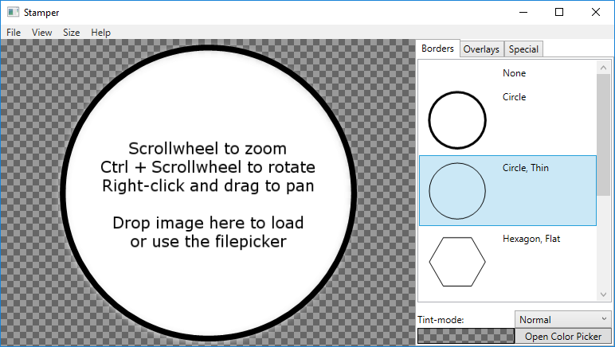

# Stamper
Stamper provides a way of turning any image into a token for use with tabletop games.

Stamper supports loading an image from the local filesystem or directly from a website and turning it into a token. The resolution of the final token is customizable, and layer sizes are automatically resized to fit the desired output-resolution. 

<p align="center">
  
</p>

## Features
* **Drag-and-drop to load images.** Load any image from a local file or skip the download by drag-and-dropping from your browser.
* **Border and overlay selection.** Stamper comes with simple borders and overlays that can be recolored and layered on top of the loaded image.
* **Custom layers.** Adding your own borders and overlays to Stamper is fast and easy. Layers can be SVG or bitmap image files.
* **Direct upload to Imgur.** Finished tokens can be saved locally or uploaded directly to Imgur for easy sharing.
* **Custom token sizes.** Stamper lets you customize the output size of your token, and scales the layers to fit.
* **Easy image manipulation.** Pan-, zoom-, and rotation-functionality is supported through simple mouse-actions.
* **Add text to your token.** Stamper lets you place text on top of your token in any position, size, font, rotation, and color.

### Adding custom layers
Stamper layers can be added through the UI, or by placing json files in the _layers_ folder. The structure of the json files is as follows:
* `name`: The name of the layer. _Required_
* `file`: A relative path from the _layers_-folder to the image file. This is the image that is shown on top of the input image in Stamper. _Required_
* `mask`: A relative path from the _layers_-folder to the image to use as a mask. On _border_ layers, this mask is applied to the underlying input image. On _overlay_ layers, this mask is applied to the overlay itself. Pixels with the color #FF00FF00 (#AARRGGBB) will be removed from the underlying image, all other colors are ignored. _Optional_
* `type`: The layer type. Allowed values are _border_ or _overlay_. _Required_

#### Example layer
```
{
  "name": "Circle",
  "file": "svg\\bCircle.svg",
  "mask": "svg\\bCircle_mask.svg",
  "type": "border"
}
```

## Installation
Stamper is Windows-only and requires v4.6.1 or newer of the .NET Framework. You can get the latest release of Stamper [here.](https://github.com/Jameak/Stamper/releases)

## License
Released under the [MIT license](LICENSE).